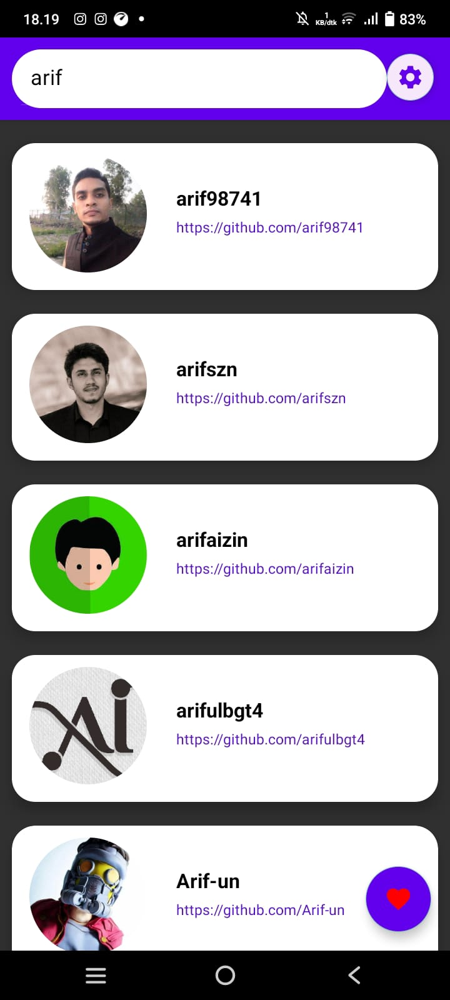

# Github-User-App-2-Submission
Aplikasi Mobile Github User 2 Android Fundamental

How to Run it : add your API Key from your github on the buildgradle.kts 

android {
  defaultConfig {
    buildConfigField("String", "KEY", "\" YOUR_API_KEY\"")
                }
        }
## Design Main Menu

  
  

## Design Detail User

  
  

## Design Theme Setting

  
  

